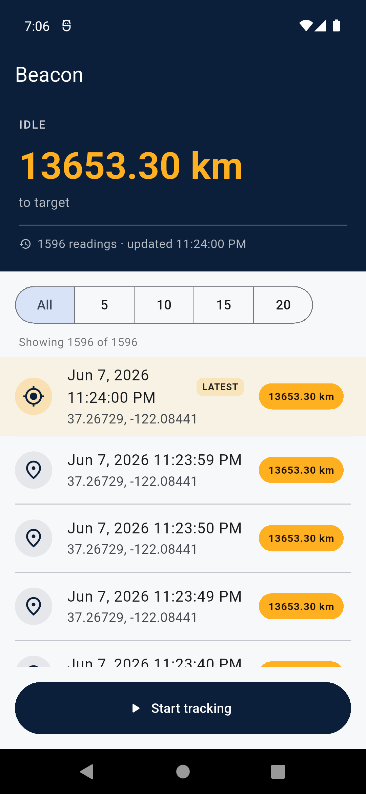

# Beacon

A small Flutter location tracker, built as a Senior Flutter Engineer take-home.
Tap **Start** and every 5 seconds it records your position, computes the
**Haversine** distance to a target coordinate (fetched from a mock backend), and
adds it to a filterable, newest-first list. **Stop** halts immediately, and
readings survive restarts.

## Screenshot

<p align="center">
  
</p>

## Run

Flutter is pinned with [FVM](https://fvm.app) (**3.41.9 / Dart 3.11.5**):

```bash
fvm install            # install the pinned SDK
fvm flutter pub get
fvm flutter run
```

No FVM? Any Flutter ≥ 3.41 works — just drop the `fvm` prefix.

## Mock backend

Target shape: `{ "id": "001", "target_lat": 1.265, "target_lng": 103.695 }`

Works out of the box against a hosted copy of
[`mock/target.json`](mock/target.json). To point it at your own server instead:

```bash
cd mock && python -m http.server 8080
fvm flutter run --dart-define=TARGET_ENDPOINT=http://localhost:8080/target.json
```

(Android emulator: use `http://10.0.2.2:8080/...` — it blocks cleartext HTTP, so
the hosted HTTPS default is simplest there.)

## Requirements

| Spec | Where |
|---|---|
| Start/Stop, fetch target, 5 s foreground polling | `tracking_controller.dart` |
| Haversine distance (m / km) | `core/utils/haversine.dart` (hand-rolled) |
| Store timestamp, lat, lng, distance | `location_reading.dart` + Hive |
| Scrollable list, filter to recent 5/10/15/20 | `home_screen.dart`, `filter_selector.dart` |
| Graceful location permissions | `location_service.dart` + snackbar / dialog |

## Architecture

One-way layering — **presentation → application → data → core**. Widgets talk
only to a Riverpod `TrackingController` (a `Notifier` over an immutable
`TrackingState`); the controller talks only to `TrackingRepository`, so the UI
never touches http / geolocator / Hive directly. The 5 s timer lives in the
controller, so it survives widget rebuilds and is cancelled on stop and dispose.

```
lib/
├── core/utils/        haversine · formatters
├── data/
│   ├── models/        target · location_reading (+ hand-written Hive adapter)
│   ├── sources/       target_api · location_service · reading_store
│   └── repositories/  tracking_repository
├── application/       tracking_controller · tracking_state · providers
└── presentation/      home_screen · widgets/
```

State machine: `idle → fetchingTarget → tracking → idle`, with an `error` branch
for a failed fetch or a blocked location read.

**Packages:** flutter_riverpod · geolocator · http · hive_ce · intl
(tests: mocktail, fake_async).

## Tests

```bash
fvm flutter test       # 53 passing
fvm flutter analyze    # clean
```

Covers the Haversine (including a cross-check against
`Geolocator.distanceBetween`), formatters, model JSON, API error handling,
permission branches, a real Hive round-trip, and the full controller state
machine with its 5 s timer (driven by `fake_async`).

## Decisions

- **First reading fires immediately** on Start, then every 5 s — instant
  feedback, and permission errors surface right away instead of after 5 s.
- **Distance format:** `< 1 km` shows metres (`742 m`), otherwise km
  (`12.48 km`). Mean Earth radius 6,371,000 m.
- **Persistence:** Hive (`hive_ce`, manual adapter, no codegen) over in-memory,
  so readings survive restarts.
- **Filtering is view-only** — storage always keeps every reading. Added an
  **All** option on top of the required 5/10/15/20.
- **Foreground only** (`Timer.periodic`); a tick is skipped if the previous GPS
  read hasn't finished.
